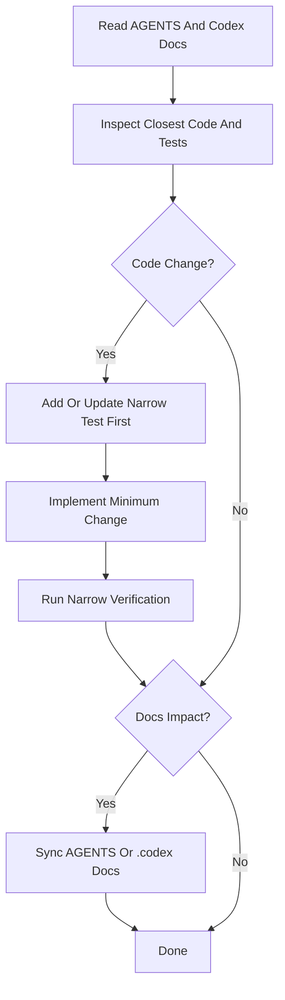

# Agent Workflow

이 문서는 현재 `JECT-Official-WebSite-Server` 저장소에서 Codex 가 작업할 때 따르는 권장 흐름이다.

## Official Flow

## Working Rules

1. 먼저 `AGENTS.md`와 `.codex/README.md`를 읽는다.
2. 가장 가까운 production 코드와 테스트를 찾는다.
3. 코드 변경이면 test-first 를 우선한다.
4. 필요한 최소 범위만 수정한다.
5. 가장 좁은 검증부터 실행한다.
6. 구조나 규칙이 바뀌면 Codex 문서를 같이 수정한다.

## What Counts As Narrow Verification

- 특정 테스트 클래스 실행
- 특정 패키지 또는 기능과 직접 연결된 `./gradlew test --tests "..."`
- 문서 전용 변경의 경우 grep / path consistency / 수동 정합성 검토

## Stop Conditions

아래 상황이면 임의 확장을 하지 않는다.

- feature 범위가 모호한 경우
- 현재 코드와 문서가 충돌해 기준이 불명확한 경우
- 보안, 캐시, 외부 연동 정책을 크게 바꿔야 하는 경우
- unrelated refactor 없이는 작업이 불가능하다고 판단되는 경우

## Doc Sync Triggers

아래가 바뀌면 `.codex` 문서도 같이 확인한다.

- package 구조 해석
- 공통 예외/응답 규칙
- 보안 규칙
- 캐시 규칙
- 테스트 전략
- agent / skill 사용 흐름
